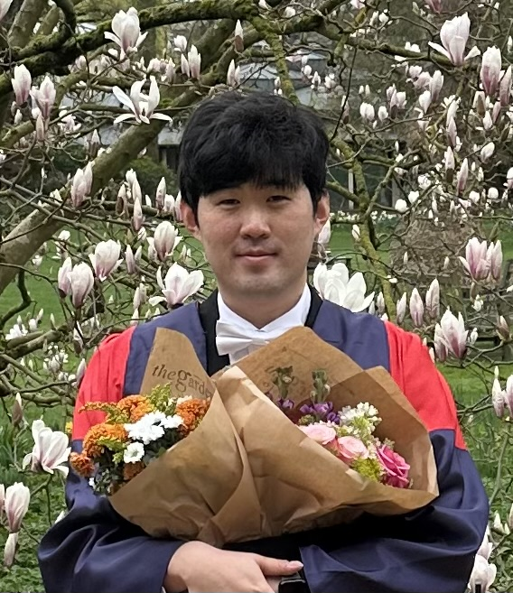

::: {.home-grid}

::: {.profile-column}

{.profile-photo}

# Taejun Park

Postdoctoral Researcher  
École Polytechnique Fédérale de Lausanne (EPFL)

<a href="mailto:taejun.park@epfl.ch"
   title="Email"
   aria-label="Email">
  <i class="fa-solid fa-envelope"></i>
</a>

<a href="https://scholar.google.com/citations?user=PvxeZ-kAAAAJ&hl=en"
   target="_blank"
   title="Google Scholar"
   aria-label="Google Scholar">
  <i class="ai ai-google-scholar"></i>
</a>

<a href="https://www.researchgate.net/profile/Taejun-Park-5?ev=hdr_xprf"
   target="_blank"
   title="ResearchGate"
   aria-label="ResearchGate">
  <i class="ai ai-researchgate"></i>
</a>

<a href="https://www.linkedin.com/in/taejun-park-882120149/"
   target="_blank"
   title="LinkedIn"
   aria-label="LinkedIn">
  <i class="fa-brands fa-linkedin"></i>
</a>

<a href="https://orcid.org/0000-0001-8759-6705"
   target="_blank"
   title="ORCID"
   aria-label="ORCID">
  <i class="ai ai-orcid"></i>
</a>

<a href="https://people.epfl.ch/taejun.park?lang=en"
   target="_blank"
   title="EPFL"
   aria-label="EPFL">
  <i class="fa-solid fa-building-columns"></i>
</a>

:::

::: {.home-content}

## About

I am a postdoctoral researcher in the **High Performance Numerical
Algorithms and Simulations (HPNALGS)** group at EPFL, working with
Prof. Laura Grigori.

I received my DPhil in Mathematics from the University of Oxford in
2025, where I was a member of the Numerical Analysis group and was
supervised by Prof. Yuji Nakatsukasa.

## Research Interests

My research is in **numerical linear algebra**, with particular interests in

- randomized algorithms for matrix computations,
- matrix perturbation theory,
- low-rank approximation.

My work focuses on developing fast, accurate, and reliable algorithms
for large-scale matrix computations.

## Selected Papers

**Approximating Sparse Matrices and their Functions using Matrix-vector Products**  
with Y. Nakatsukasa · *ACHA*, 2026 · [DOI](https://doi.org/10.1016/j.acha.2026.101869) · [arXiv](https://arxiv.org/abs/2310.05625)

**Fast Rank Adaptive CUR via a Recycled Small Sketch**  
with N. Pritchard, Y. Nakatsukasa, and P.-G. Martinsson · Preprint, 2025 · [arXiv](https://arxiv.org/abs/2509.21963)

**Low-rank Approximation of Parameter-dependent Matrices via CUR Decomposition**  
with Y. Nakatsukasa · *SISC*, 2025 · [DOI](https://doi.org/10.1137/24M1683998) · [arXiv](https://arxiv.org/abs/2408.05595)

**Randomized Low-Rank Approximation for Symmetric Indefinite Matrices**  
with Y. Nakatsukasa · *SIMAX*, 2023 · [DOI](https://doi.org/10.1137/22M1538648) · [arXiv](https://arxiv.org/abs/2212.01127)

[**All papers →**](publications.qmd)

:::

:::